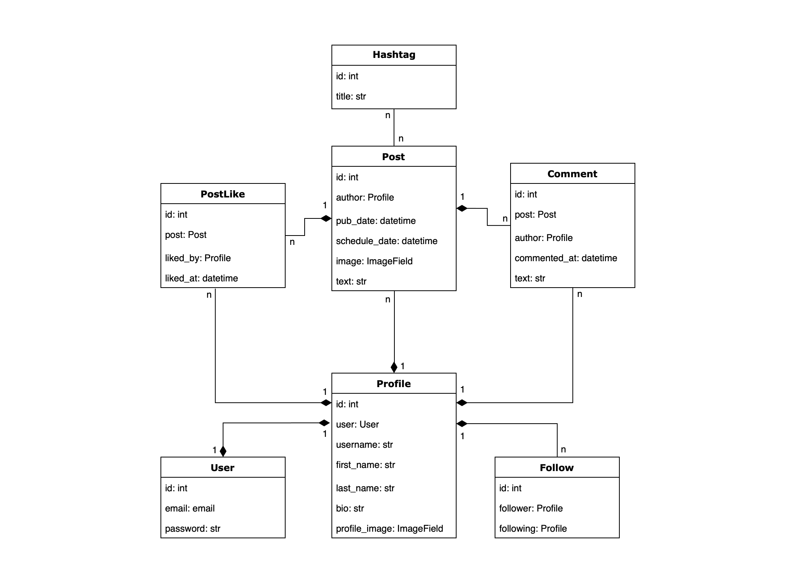

# Social Media API

This repository contains a RESTful API built in Django and Django REST Framework for a social media platform. 
The API allows to users to create profiles, follow other users, create and retrieve posts, manage likes and comments,
and perform basic social media actions.


## How to Use
1.  Clone the repository
```bash
git clone https://github.com/loplicat/social-media-api.git
```

2. Create a virtual environment and activate it:
```bash
python -m venv venv
source venv/bin/activate
```
3. Install requirements:
```bash
pip install -r requirements.txt
```
4. Copy .env.sample -> .env and set up environmental variables.


5. Apply migrations and start the server:
```bash
python manage.py migrate
python manage.py runserver
```
6. Run this command to load prepared data from the fixture:
```bash
python manage.py loaddata social_media_data.json
```

7. Run Celery worker to enable scheduled posts:
```bash
celery -A social_media_api worker -l info
```

8. Run app:
```bash
python manage.py runserver
```

## API Endpoints

Below is a list of the API endpoints provided by the project:

- **Posts**: 
  - `api/content/posts/`, 
  - `api/content/posts/<pk>/comments/`,
  - `api/content/posts/<pk>/like/`, 
  - `api/content/posts/<pk>/unlike/`,
  - `api/content/posts/my-posts/`,
  - `api/content/posts/feed/`,
  - `api/content/posts/liked/`


- **Profiles**: 
  - `api/content/profiles/`,
  - `api/content/me/`,
  - `api/content/me/followers/`,
  - `api/content/me/following/`,
  - `api/content/profiles/<pk>/follow/`,
  - `api/content/profiles/<pk>/unfollow/`


- **Users**: 
  - `api/user/register/`,
  - `api/user/me/`,
  - `api/user/token/`,
  - `api/user/token/refresh/`,
  - `api/user/token/verify/`,
  - `api/user/logout/`


- **Documentation**:
  - `api/doc/swagger/`

Each endpoint supports a range of operations, including listing and creating. 
Some of them provide operations of retrieving, updating, and filtering.


## Main features

* **User Profile Management**: Users can create, retrieve, and update their profiles, including profile pictures, bios,
and other details. The API also provides endpoints to search for users based on usernames and other criteria.


* **Follow/Unfollow**: Users can follow and unfollow other users, and retrieve lists of their followers and those they are
following.


*  **Post Creation and Management**: Users can create, retrieve, and update their posts, with text content and optional
media attachments (images as an optional feature). The API provides ways to retrieve posts by a range of criteria
including hashtags and authorship by followed users.


* **Interactions**: Users can like/unlike posts, retrieve posts they have liked, and add comments to posts.


* **User Registration and Authentication**: Users register with their email and passwords and receive a token upon login
for subsequent authentication. The API also includes a logout function.


* **Scheduled Post Creation**: Using Celery, users can schedule posts to be created at specific times.


* **API Permissions**: The API uses Django's authentication and permission classes to ensure security and confidentiality.
Only authenticated users can perform actions like creating posts, liking posts, and following/unfollowing others.


* **API Documentation**: All the endpoints are well-documented by DRF Spectacular with clear instructions and examples for use.

## DB Structure

